# crosswalk-kit

Build a cross-framework compliance knowledge graph from your own licensed
framework texts and policy documents — typed, rationale-bearing, and
queryable, instead of a spreadsheet that goes stale the day someone edits a
cell.

## What this is

Compliance teams routinely need to know how one framework's requirements
relate to another's — where ISO 27001 controls satisfy a NIST function,
where an internal policy already covers a CAF outcome, where two frameworks
genuinely conflict. The usual answer is a hand-maintained spreadsheet: one
column per framework, cells marked "covers" or "partial", no explanation of
*why*, and no way to ask it a question. It stops being trustworthy the
moment a framework revises a clause number.

crosswalk-kit builds the same crosswalk as a **graph** instead. Every
requirement becomes a typed node with a canonicalised statement of intent.
Every relationship between requirements is a typed, directed edge —
`EQUIVALENT_TO`, `NARROWER_THAN`, `BROADER_THAN`, `RELATED_TO`,
`CONFLICTS_WITH` — carrying the LLM's rationale for asserting it. The result
lives in Neo4j, so "what covers this control", "where are the gaps", and
"where do these two frameworks actually disagree" are Cypher queries, not
spreadsheet archaeology. Gaps aren't pre-computed and baked in; they fall
out naturally as "nodes with no adjudicated edge" at query time, so they're
always current with whatever's in the graph.

You bring your own AI (a subscription coding agent such as Claude Code, or
direct API access) and your own licensed framework texts. crosswalk-kit is
the pipeline code, the adapter pattern, and one shippable dataset (NCSC
CAF 4.0) to prove it works end to end.

## How it works

Seven pipeline stages turn source text into a queryable graph. Gap analysis
is not a pipeline stage — it's a property of the finished graph, computed
whenever you query it.

```mermaid
flowchart LR
    A["1. Adapt<br/>framework text → typed nodes"] --> B["2. Canonicalise<br/>LLM extracts requirement intent"]
    B --> C["3. Embed<br/>intent → vector"]
    C --> D["4. Candidates<br/>cosine similarity search"]
    D --> E["5. Adjudicate<br/>LLM assigns typed edge + rationale"]
    E --> F["6. Verify<br/>adversarial second pass"]
    F --> G["7. Load<br/>nodes + edges → Neo4j"]
    G -.-> H(["Gaps: computed at\nquery time, not stored"])

    classDef stage fill:#1f6feb,stroke:#1f6feb,color:#fff
    classDef derived fill:none,stroke:#8b949e,stroke-dasharray: 4 3,color:#8b949e
    class A,B,C,D,E,F,G stage
    class H derived
```

1. **Adapt** — a small per-framework parser turns source text (a spreadsheet,
   a clause list, your own policy documents) into the kit's typed node
   schema.
2. **Canonicalise** — an LLM reads each requirement's raw text and writes a
   single canonical statement of its intent, so wording differences between
   frameworks stop hiding genuine equivalence.
3. **Embed** — canonical intents are embedded via any Ollama or
   OpenAI-compatible endpoint.
4. **Candidates** — cosine similarity over the embeddings proposes pairs
   worth adjudicating, so the LLM never has to compare every node against
   every other node.
5. **Adjudicate** — an LLM looks at each candidate pair and either assigns a
   typed edge with a written rationale, or rejects the pair.
6. **Verify** — a second, adversarial LLM pass re-checks a sample of
   adjudications, trying to argue them wrong, before they're trusted.
7. **Load** — verified nodes and edges are written into Neo4j.

## What you need

- **Python** and [uv](https://docs.astral.sh/uv/) for dependency management.
- **Neo4j** — the free Community Edition or Neo4j Desktop is enough; no
  Enterprise features are used.
- **An embedding model** reachable through any Ollama or OpenAI-compatible
  HTTP endpoint (default: `http://localhost:11434`, overridable via
  `CROSSWALK_OLLAMA_URL`).
- **An LLM for the canonicalise and adjudicate steps** — either a
  subscription coding agent (Claude Code or similar) driving the pipeline
  interactively, or direct API calls. See
  [`docs/AGENT_ADJUDICATION.md`](docs/AGENT_ADJUDICATION.md) for the
  agent-driven workflow.

Neo4j credentials are read from environment variables only
(`NEO4J_URI`, `NEO4J_USERNAME`, `NEO4J_PASSWORD`) — never written into
config files or source.

## Quickstart

Start with [`examples/README.md`](examples/README.md), which walks through
the full pipeline on two small public frameworks so you can see every stage
run before pointing the kit at your own material.

## Licensing

- **Code** is MIT licensed (see [`LICENSE`](LICENSE)) — use it, fork it,
  build on it.
- **NCSC CAF 4.0 data** ships in `crosswalk/data/` under the Open Government
  Licence v3.0, with attribution. See [`NOTICE.md`](NOTICE.md).
- **Other frameworks** (ISO 27001/27002, ISO 42001, NIST, etc.) are not
  shipped. Their text is copyrighted; bring your own licensed copy and run
  the adapter yourself. Node files derived from ISO text must not be
  committed anywhere public.
- **Secure Controls Framework (SCF) validation** in `validation/` is
  optional. The SCF is CC BY-ND 4.0 — download it yourself from
  [securecontrolsframework.com](https://securecontrolsframework.com) and
  keep derived mapping data local.

Full details in [`NOTICE.md`](NOTICE.md).

## Repo layout

| Path | What's there |
|---|---|
| `crosswalk/adapters/` | One parser per framework: turns source text into the kit's typed node schema |
| `crosswalk/` | Pipeline scripts — embed, candidates, prep/API adjudication, merge judgments, build edges, load Neo4j |
| `crosswalk/data/` | Ready-to-load node files; only `caf_4_0_nodes.json` ships, everything else you generate yourself |
| `crosswalk/out/` | Pipeline working files (candidate lists, adjudication logs) — gitignored |
| `examples/` | A worked, end-to-end example on two small public frameworks |
| `METHODOLOGY.md` | Why canonicalisation, candidate generation and adjudication are designed the way they are |
| `docs/AGENT_ADJUDICATION.md` | Running canonicalise/adjudicate with a subscription coding agent instead of API calls |
| `validation/` | Optional external validation against the Secure Controls Framework |

See [`METHODOLOGY.md`](METHODOLOGY.md) for the reasoning behind
the pipeline design, and
[`docs/AGENT_ADJUDICATION.md`](docs/AGENT_ADJUDICATION.md) for driving
canonicalisation and adjudication from an agentic coding assistant rather
than raw API calls.

## Honest results

This pipeline was built out against a reference deployment mapping five
public frameworks and an internal policy estate of roughly 113 documents
into one graph — 2,400+ nodes and 10,000+ typed relationships. Every
adjudicated edge went through the adversarial verification pass described
above before being trusted, and the resulting crosswalk was checked against
an external reference: the Secure Controls Framework's own STRM mappings,
used as an independent sanity check rather than a source of truth. That's
the scale and rigour this kit is designed to reach — your own graph will be
smaller or larger depending on how many frameworks and documents you feed
it, but the pipeline is the same one.
