# crosswalk-kit

Build a cross-framework compliance knowledge graph from your own licensed
framework texts and policy documents — typed, rationale-bearing, and
queryable, instead of a spreadsheet that goes stale the day someone edits a
cell.

## What this is

Compliance teams routinely need to know how one framework's requirements
relate to another's — where ISO 27001 controls satisfy a NIST function,
where an internal policy already covers a CAF outcome, where two frameworks
genuinely conflict. The usual answer is a hand-maintained spreadsheet: one
column per framework, cells marked "covers" or "partial", no explanation of
*why*, and no way to ask it a question. It stops being trustworthy the
moment a framework revises a clause number.

crosswalk-kit builds the same crosswalk as a **graph** instead. Every
requirement becomes a typed node with a canonicalised statement of intent.
Every relationship between requirements is a typed, directed edge —
`EQUIVALENT`, `PARTIAL`, `SUPPORTS`, `INFORMS` — carrying the LLM's
rationale for asserting it. Pairs that survive none of those tests are not
written at all. The result lives in Neo4j, so "what covers this control",
"where are the gaps", and "where do these two frameworks actually disagree"
are Cypher queries, not spreadsheet archaeology. Gaps aren't pre-computed
and baked in; they fall out naturally as "nodes with no adjudicated edge" at
query time, so they're always current with whatever's in the graph.

You bring your own AI (a subscription coding agent such as Claude Code, or
direct API access) and your own licensed framework texts. crosswalk-kit is
the pipeline code, the adapter pattern, and one shippable dataset (NCSC
CAF 4.0) to prove it works end to end.

## How it works

Seven pipeline stages turn source text into a queryable graph. Gap analysis
is not a pipeline stage — it's a property of the finished graph, computed
whenever you query it.

```mermaid
flowchart LR
    A["1. Decompose<br/>documents → requirement units"] --> B["2. Canonicalise<br/>LLM extracts requirement intent"]
    B --> C["3. Embed<br/>intent → vector"]
    C --> D["4. Candidates<br/>cosine similarity search"]
    D --> E["5. Adjudicate<br/>LLM assigns typed edge + rationale"]
    E --> F["6. Verify<br/>adversarial second pass"]
    F --> G["7. Load<br/>nodes + edges → Neo4j"]
    G -.-> H(["Gaps: computed at\nquery time, not stored"])

    classDef stage fill:#1f6feb,stroke:#1f6feb,color:#fff
    classDef derived fill:none,stroke:#8b949e,stroke-dasharray: 4 3,color:#8b949e
    class A,B,C,D,E,F,G stage
    class H derived
```



Each stage below states what it does and — more usefully — **what goes wrong
here, and which way the design deliberately biases** to keep the damage
recoverable.

1. **Decompose** — a small per-framework parser (`crosswalk/adapters/`)
   turns source text into requirement-bearing units. The unit of mapping is
   never a whole document or control family; it's the smallest passage that
   carries its own intent. A clause with five numbered sub-requirements is
   five nodes, not one. Structural nodes (objectives, headings, whole
   documents) are containers only and never enter adjudication.
   *This is where accuracy is won or lost, before any embedding or LLM
   judgement runs* — granularity mismatches are the single biggest source of
   false "no relation" verdicts. Bias toward splitting: two units wrongly
   separated can still both match; one unit wrongly fused can never be
   matched to only half of itself.
2. **Canonicalise** — an LLM rewrites each unit's intent into a fixed
   two-part shape (`requires: … ; in order to: …`), so that wording
   differences between an imperative ISO-style control, a goal-stated CAF
   outcome and hedged internal policy prose stop hiding genuine equivalence.
   *Risk: normalisation smooths away real nuance.* Mitigation: the verbatim
   `raw_text` always travels alongside the canonical form, and adjudication
   sees both.
3. **Embed** — canonical intents are embedded via any Ollama or
   OpenAI-compatible endpoint. The embedder is not assumed to be good
   enough; `validate_embedder.py` gates it against known-related pairs
   before the corpus is trusted to it (§6 of the methodology). In the
   reference deployment this bake-off ran across five candidate models
   before one was chosen.
4. **Candidates** — cosine similarity over the embeddings proposes pairs
   worth adjudicating, so the LLM never compares every node against every
   other node. *Error costs are asymmetric and that drives the tuning:* a
   false positive costs the adjudicator one quick "no relation" verdict; a
   false negative is unrecoverable, because a pair that never becomes a
   candidate never gets a second look. So `k` and `floor` are tuned
   generous, and tuned empirically from the cosine distribution of known
   true pairs — not guessed.
5. **Adjudicate** — an LLM looks at each candidate pair and either assigns a
   typed edge with a written rationale, or returns `no_relation`. Every pair
   in gets exactly one verdict line out, which is what makes a batch
   auditable. *Risk: over-claiming coverage*, which is the expensive
   direction of error in compliance — it tells you you're covered when
   you're not.
6. **Verify** — a second, adversarial pass re-checks the strong claims
   (`EQUIVALENT`, high-confidence `PARTIAL`), tasked with arguing them
   wrong rather than confirming them. Downgrades are merged back with the
   verifier's reasoning appended to the rationale, so the correction stays
   visible in the graph rather than silently overwriting the original call.
7. **Load** — verified nodes and edges are written into Neo4j with
   idempotent `MERGE`.

## Follow one requirement through

The stages are easier to hold onto if you watch a single requirement travel
all of them. This example is **illustrative** — the framework wording is
paraphrased, because ISO text is copyrighted and not redistributable (see
[Licensing](#licensing)) — but the shape, and the outcome, are taken from a
real adjudication in the reference deployment.

**Stage 1 — Decompose.** A framework control about clock synchronisation
becomes one leaf, requirement-bearing node. Its parent section header
becomes a structural node that will never be adjudicated.

```
id:        FRAMEWORK:2022:8.17
node_type: control
raw_text:  "System clocks should be synchronised to approved time sources."   (paraphrased)
```

**Stage 2 — Canonicalise.** The LLM strips the idiom and states obligation
and purpose in the fixed shape:

```
canonical_intent: "requires synchronisation of system clocks to approved time
                   sources; in order to correlate security events accurately
                   and support incident investigation."
```

The `in order to:` half is doing real work here: it's what will later stop
this matching an unrelated requirement that merely mentions timestamps.

**Stage 3–4 — Embed and find candidates.** That intent is vectorised, and
cosine search proposes the internal statements nearest to it. In the real
run this control drew **11 candidate pairs** — a deliberately wide net, most
of which will be rejected.

**Stage 5 — Adjudicate.** An internal cloud-hosting standard requiring
authenticated NTP synchronisation is compared against it. The adjudicator
sees both canonical intents *and* both verbatim texts, and calls it:

```
relation:   EQUIVALENT
confidence: 0.85
rationale:  "Authenticated NTP synchronisation from a secure source fully
             meets the requirement to synchronise clocks to approved sources."
```

**Stage 6 — Verify.** Because `EQUIVALENT` is a strong claim, it goes to the
adversarial pass, which tries to break it — and does:

```
relation:   PARTIAL            (downgraded)
rationale:  "... [downgraded from EQUIVALENT by verifier: the control requires
             clocks across ALL relevant information processing systems
             organisation-wide, not just cloud systems, so a cloud-only rule
             covers a subset rather than the full estate.]"
```

That is the whole argument for the verification stage in one line. The first
pass was reasonable and wrong in the expensive direction — it would have
recorded full coverage of an estate-wide control from a cloud-only standard.
This exact failure mode (a narrower internal implementation claiming
equivalence with a broader external control) is the most common downgrade in
the reference deployment.

**Stage 7 — Load.** The surviving `PARTIAL` edge is written to Neo4j with
both the original and the verifier's reasoning attached, and the control now
answers Cypher queries about what covers it — and, crucially, what still
doesn't.

## What the pipeline actually did

Numbers from the reference deployment: five public frameworks (NCSC CAF 4.0,
ISO 27001, ISO 27002, ISO 42001, NHS DSPT) plus an internal policy estate,
adjudicated with a subscription coding agent rather than API calls.

| Stage | Count |
|---|---|
| Source nodes decomposed | **2,322** across 6 sources |
| Mappable (canonicalised + embedded) leaf nodes | **1,595** |
| Candidate pairs proposed by cosine search | **14,436** |
| Adjudicated verdicts returned | **14,346** |
| — dropped as `no_relation` | **6,112** (42.6%) |
| — kept as typed edges | **8,234** |
| Strong claims sent to adversarial verification | `EQUIVALENT` + high-confidence `PARTIAL` |
| Verdicts changed by the verifier | **293** (of which **61** removed the edge entirely) |
| Final edges loaded | **8,455** |

Final relation mix: `PARTIAL` 5,070 · `SUPPORTS` 2,898 · `EQUIVALENT` 278 ·
`INFORMS` 209.

Two things worth reading off that table. First, **42.6% of everything the
similarity search proposed was rejected on inspection** — which is the
candidate stage working as designed, casting wide and letting adjudication
do the discriminating, not a sign the embeddings were poor. Second, **the
adversarial pass changed 293 verdicts and deleted 61 relationships
outright.** A verification stage that never overturns anything is
decoration; this one demonstrably does work, and the largest single class of
correction was systematic — reused internal boilerplate being called
`EQUIVALENT` to itself across documents when the shared template governs a
different object in each instance.

The embedder itself was chosen by bake-off across five candidate models
(`qwen3-embedding` at 0.6b/4b/8b, `bge-m3`, `snowflake-arctic-embed2`,
`embeddinggemma`) rather than by reputation; the reference run settled on
`qwen3-embedding:8b` at 4,096 dimensions.

**External sanity check.** The finished crosswalk was compared against the
Secure Controls Framework's own STRM mappings across six framework pairs —
as an independent reference, explicitly *not* as ground truth. Across those
pairs the kit asserted 350 edges where SCF recorded 459 co-mappings, with
115 direct agreements. The disagreements are informative rather than
damning, and mostly structural: SCF routes mappings through a metaframework
hub, which bundles relationships that a direct pairwise comparison doesn't
generate. `validation/README.md` explains how to read the three result
classes and why `scf_only` counts inflate.

## What you need

- **Python** and [uv](https://docs.astral.sh/uv/) for dependency management.
- **Neo4j** — the free Community Edition or Neo4j Desktop is enough; no
  Enterprise features are used.
- **An embedding model** reachable through any Ollama or OpenAI-compatible
  HTTP endpoint (default: `http://localhost:11434`, overridable via
  `CROSSWALK_OLLAMA_URL`).
- **An LLM for the canonicalise and adjudicate steps** — either a
  subscription coding agent (Claude Code or similar) driving the pipeline
  interactively, or direct API calls. See
  [`docs/AGENT_ADJUDICATION.md`](docs/AGENT_ADJUDICATION.md) for the
  agent-driven workflow.

Neo4j credentials are read from environment variables only
(`NEO4J_URI`, `NEO4J_USERNAME`, `NEO4J_PASSWORD`) — never written into
config files or source.

## Quickstart

Start with [`examples/README.md`](examples/README.md), which walks through
the full pipeline on two small public frameworks so you can see every stage
run before pointing the kit at your own material.

## Licensing

- **Code** is MIT licensed (see [`LICENSE`](LICENSE)) — use it, fork it,
  build on it.
- **NCSC CAF 4.0 data** ships in `crosswalk/data/` under the Open Government
  Licence v3.0, with attribution. See [`NOTICE.md`](NOTICE.md).
- **Other frameworks** (ISO 27001/27002, ISO 42001, NIST, etc.) are not
  shipped. Their text is copyrighted; bring your own licensed copy and run
  the adapter yourself. Node files derived from ISO text must not be
  committed anywhere public.
- **Secure Controls Framework (SCF) validation** in `validation/` is
  optional. The SCF is CC BY-ND 4.0 — download it yourself from
  [securecontrolsframework.com](https://securecontrolsframework.com) and
  keep derived mapping data local.

Full details in [`NOTICE.md`](NOTICE.md).

## Repo layout

| Path | What's there |
|---|---|
| `crosswalk/adapters/` | One parser per framework: decomposes source text into requirement units |
| `crosswalk/` | Pipeline scripts — embed, candidates, prep/API adjudication, merge judgments, build edges, load Neo4j |
| `crosswalk/RUBRIC.md` | The adjudication rubric handed to the LLM: relation definitions, decision tests, calibration rules |
| `crosswalk/data/` | Ready-to-load node files; only `caf_4_0_nodes.json` ships, everything else you generate yourself |
| `crosswalk/out/` | Pipeline working files (candidate lists, adjudication logs) — gitignored |
| `examples/` | A worked, end-to-end example on two small public frameworks |
| `METHODOLOGY.md` | Why decomposition, canonicalisation, candidate generation and adjudication are designed the way they are |
| `docs/AGENT_ADJUDICATION.md` | Running canonicalise/adjudicate with a subscription coding agent instead of API calls |
| `validation/` | Optional external validation against the Secure Controls Framework |

See [`METHODOLOGY.md`](METHODOLOGY.md) for the reasoning behind
the pipeline design, and
[`docs/AGENT_ADJUDICATION.md`](docs/AGENT_ADJUDICATION.md) for driving
canonicalisation and adjudication from an agentic coding assistant rather
than raw API calls.
